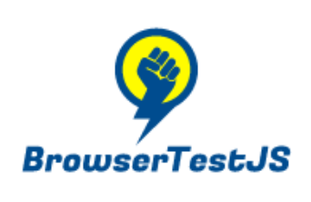

# BrowserTestJS 


Run unit tests in the browser.

[Demo](https://cyphrme.github.io/BrowserTestJS/example/browsertest/browsertest.html)

[Real use in a project](https://cyphrme.github.io/Coze_js/verifier/browsertest/browsertest.html)  (from [Coze JS](https://github.com/Cyphrme/Coze_js)).


# How to use BrowserTestJS

Import BrowserTestJS as a submodule to the project.

``` sh
git submodule add git@github.com:Cyphrme/BrowserTestJS.git browsertest
```

Which will add `browsertest` to the following project:

```dir
my_project/
 ├─ My_File.html
 ├─ My_File.js
 ├─ ...
 └─ browsertest/
```

Write tests in `test_unit.js` (above the `browsertest` directory).
`example/test_unit.js` may be used as a starter template.

```dir
my_project/
 ├─ My_File.html
 ├─ My_File.js
 ├─ ...
 ├─ test_unit.js
 └─ browsertest/
```


## Updating BrowserTestJS
A project can update by running the following command from the directory where
`.gitmodules` exists:

```sh
git submodule update --remote
```

If the git submodule is causing issues, use `--force`:

```
git submodule add --force git@github.com:Cyphrme/BrowserTestJS.git verifier/browsertest
```


## Run tests locally with a local HTTP server
Go must be installed.

```sh
cd $my_project/browsertest
go run server.go
```

Then go to `localhost:8082`.  

#### Why use a Go server for testing?
HTTPS is vital since some Javascript, especially cryptographic functions, are
only available over HTTPS ("secure contexts").  Static HTML files cannot call
external Javascript modules when loading static files (arbitrary
browser/standard limitation): See [this stack
overflow](https://stackoverflow.com/questions/46992463/es6-module-support-in-chrome-62-chrome-canary-64-does-not-work-locally-cors-er?rq=1). 

> ES6 modules are subject to same-origin policy. This means that you cannot
import them from the file system or cross-origin without a CORS header (which
cannot be set for local files).

That leaves two options:

1. Run a HTTPS server.
2. Inline all Javascript modules into a single file.  

A Go server requires only a few lines of code and adds a single dependency (Go
itself). 

Alternatively, inlining all Javascript into a single `js.min` file might be
feasible in a single page, static HTML file, then dump the results in a
`<script>` section of `verifier/browsertest/test.html`  This isn't implemented,
but this is how it would be done using esbuild:

```sh
esbuild join_test.js --bundle --format=esm --minify --sourcemap=inline  --outfile=test_coze.min.js
```

# Parameters for `test_unit.js`

There are three parts to each test:
1. Writing the "schema" of the test, which includes:
    - The Name of the test, which is the name used to differ tests and shows in browser.
    - The Function of the test, which is the test function testing something in your source code.
    - The Golden results of the test, which is the expected behavior/results from running your test function.
2. Writing the test function that tests your source code.
3. Invoking the test by placing the test schema in the `TestsToRun` variable.
4. The `TestGUIOptions` is an optional parameter and is not required for
   TestBrowserJS. `TestGUIOptions` includes stylesheet options for your project.


## Logo license
"you are free to use your logo for promotional purposes"
https://support.freelogodesign.org/hc/en-us/categories/360003253451-Copyrights


----------------------------------------------------------------------
# Attribution, Trademark notice, and License
BrowserTestJS and ExampleBrowserTestJS is released under The 3-Clause BSD License. 

"Cyphr.me" is a trademark of Cypherpunk, LLC. The Cyphr.me logo is all rights
reserved Cypherpunk, LLC and may not be used without permission.